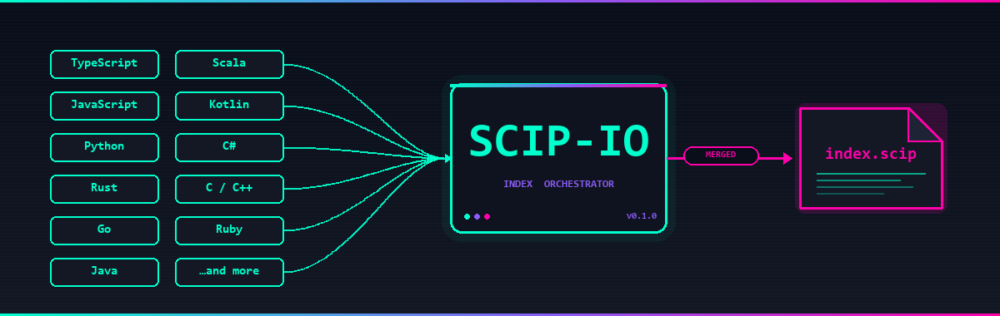
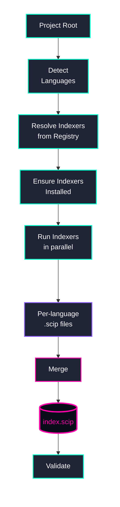
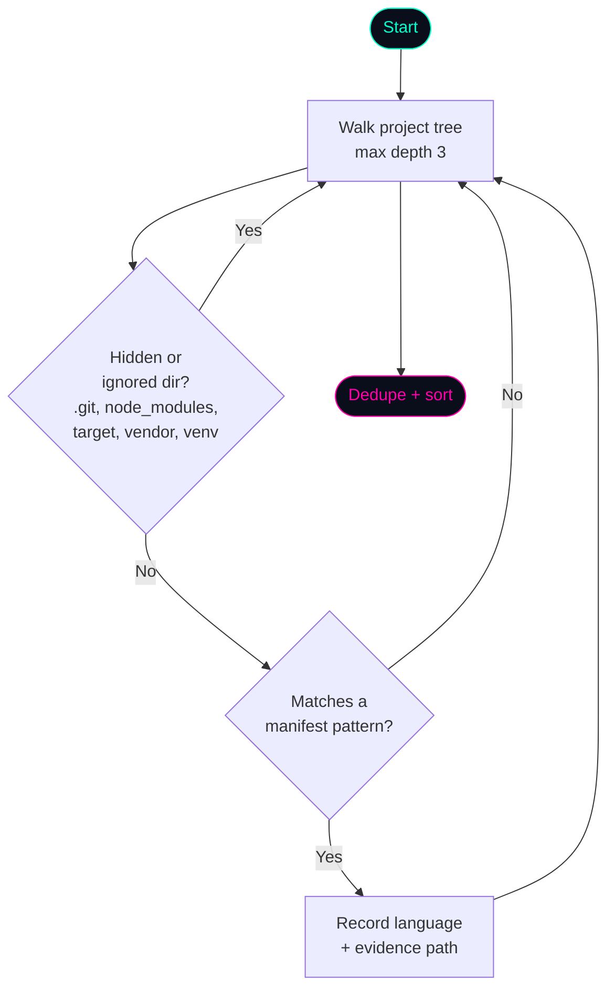
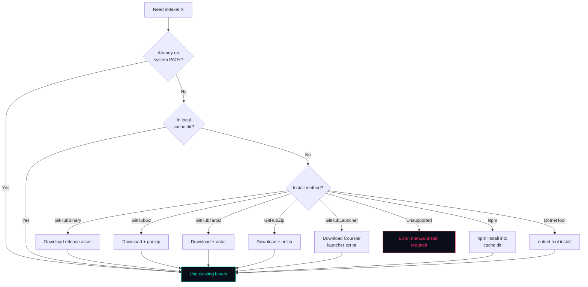
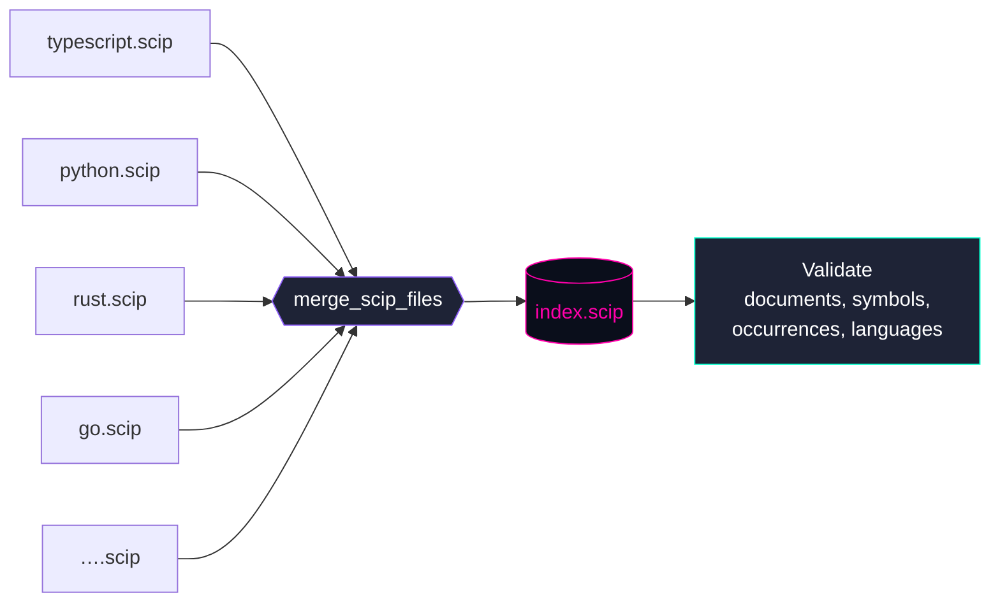

<p align="center">
  
</p>

<h1 align="center">SCIP-IO</h1>

<p align="center">
  <strong>One command. Every language. A single <code>index.scip</code>.</strong>
</p>

<p align="center">
  <em>SCIP Index Orchestrator — detect languages, download indexers, run them, merge the results.</em>
</p>

---

## What is SCIP-IO?

**SCIP-IO** is a polyglot [SCIP](https://sourcegraph.com/docs/code-search/code-navigation/scip) index orchestrator written in Rust. It takes the pain out of generating precise code-intelligence indexes for multi-language projects by doing the whole pipeline for you:

1. **Detects** every language in your project from manifest files.
2. **Installs** the correct SCIP indexer binary for each language (downloading from GitHub releases, npm, `dotnet tool`, Coursier, or reusing what's already on your `PATH`).
3. **Runs** each indexer against your project with sensible defaults.
4. **Merges** every per-language `.scip` file into a single deterministic `index.scip`.
5. **Validates** the final index so you know it's wellformed.

It ships as both a **CLI** (`scip-io`) and a **Tauri GUI** with a dark/cyberpunk-corporate aesthetic — use whichever fits your workflow.

### Why?

SCIP is the modern successor to LSIF for code intelligence. Every language has its own indexer, every indexer has its own install method, flags, and output conventions, and merging them requires understanding the SCIP protobuf schema. SCIP-IO collapses that entire workflow into:

```sh
scip-io index
```

---

## Supported Languages

SCIP-IO currently orchestrates **11 languages** across **9 different indexers**:

| Language     | Indexer           | Install Method        | Detected From                         |
|--------------|-------------------|-----------------------|---------------------------------------|
| TypeScript   | `scip-typescript` | npm                   | `tsconfig.json`                       |
| JavaScript   | `scip-typescript` | npm                   | `package.json`                        |
| Python       | `scip-python`     | npm                   | `pyproject.toml`, `setup.py`, `setup.cfg`, `requirements.txt`, `Pipfile` |
| Rust         | `rust-analyzer`   | GitHub release (gz/zip) | `Cargo.toml`                        |
| Go           | `scip-go`         | GitHub release (tar.gz) | `go.mod`                            |
| Java         | `scip-java`       | Coursier launcher     | `pom.xml`, `build.gradle`             |
| Scala        | `scip-java`       | Coursier launcher     | `build.sbt`                           |
| Kotlin       | via `scip-java`   | compiler plugin       | `build.gradle.kts`, `settings.gradle.kts` |
| C#           | `scip-dotnet`     | `dotnet tool`         | `*.csproj`, `*.sln`                   |
| Ruby         | `scip-ruby`       | GitHub release        | `Gemfile`                             |
| C / C++      | `scip-clang`      | GitHub release        | `CMakeLists.txt`, `compile_commands.json` |

SCIP-IO will also pick up any of these binaries already on your system `PATH` before downloading a fresh copy.

---

## How it works

### High-level pipeline



### Language detection

Detection is **manifest-driven**, not extension-based. Walking every `.ts` or `.py` file in a monorepo is slow and noisy; SCIP-IO looks for the files that unambiguously declare a language project:



### Indexer installation strategy

SCIP-IO supports several install methods because no two SCIP indexers ship the same way:



### Merge

Merging is deterministic: same inputs always produce a byte-identical `index.scip`, regardless of which order indexers finished. Overlapping documents (e.g. generated files touched by more than one indexer) are combined rather than duplicated.



---

## Installation

### Quick install (CLI)

**Linux / macOS:**

```sh
curl -LsSf https://github.com/GlitterKill/scip-io/releases/latest/download/install.sh | sh
```

**Windows (PowerShell):**

```powershell
irm https://github.com/GlitterKill/scip-io/releases/latest/download/install.ps1 | iex
```

Both scripts download the right binary for your OS/architecture, extract it to a user-writable location (`~/.local/bin` or `%LOCALAPPDATA%\scip-io\bin`), and update your `PATH`.

### Manual download

Grab the right file for your platform from the [latest release](https://github.com/GlitterKill/scip-io/releases/latest):

| Platform                       | File                                                       |
|--------------------------------|------------------------------------------------------------|
| **CLI — Windows x64**          | `scip-io-vX.Y.Z-x86_64-pc-windows-msvc.zip`                |
| **CLI — macOS x64 (Intel)**    | `scip-io-vX.Y.Z-x86_64-apple-darwin.tar.gz`                |
| **CLI — macOS ARM (Silicon)**  | `scip-io-vX.Y.Z-aarch64-apple-darwin.tar.gz`               |
| **CLI — Linux x64**            | `scip-io-vX.Y.Z-x86_64-unknown-linux-gnu.tar.gz`           |
| **GUI — Windows installer**    | `SCIP-IO_X.Y.Z_x64-setup.exe` or `SCIP-IO_X.Y.Z_x64_en-US.msi` |
| **GUI — macOS disk image**     | `SCIP-IO_X.Y.Z_x64.dmg` / `SCIP-IO_X.Y.Z_aarch64.dmg`      |
| **GUI — Linux package**        | `scip-io_X.Y.Z_amd64.deb` or `scip-io_X.Y.Z_amd64.AppImage` |

Verify your download with `SHA256SUMS.txt` attached to the release.

> **Heads up — unsigned binaries:** Until SCIP-IO is code-signed, Windows SmartScreen will warn "unrecognized app" (click **More info → Run anyway**) and macOS Gatekeeper will block first launch (right-click the app → **Open**, then confirm).

### Build from source

Requires **Rust stable 1.80+** ([rustup.rs](https://rustup.rs)). For the GUI you also need the [Tauri 2 prerequisites](https://v2.tauri.app/start/prerequisites/) (WebView2 on Windows, `webkit2gtk` on Linux).

```sh
git clone https://github.com/GlitterKill/scip-io.git
cd scip-io

# CLI only
cargo build --release -p scip-io-cli
./target/release/scip-io --help

# GUI
cargo install tauri-cli --version "^2.0"
cargo tauri build
```

The CLI binary is `scip-io`; the GUI bundles as `SCIP-IO` via Tauri.

### Language toolchains

SCIP-IO downloads and manages indexer binaries, but some indexers need a language runtime installed on your system:

- **Node.js** — for `scip-typescript` and `scip-python` (both npm packages)
- **JVM** — for `scip-java` (Scala and Java indexing)
- **.NET SDK** — for `scip-dotnet` (C# indexing)

Other indexers (`rust-analyzer`, `scip-go`, `scip-ruby`, `scip-clang`) ship as standalone binaries and don't need extra toolchains. Run `scip-io status` to see which indexers are ready.

## Getting Started

### Your first index

```sh
cd your/polyglot/project
scip-io detect          # see what SCIP-IO found
scip-io index           # download indexers, run them, merge → index.scip
scip-io validate index.scip
```

That's it. Point any SCIP-consuming tool at `index.scip`.

---

## CLI Commands

All commands accept `--help`. The examples below assume you're running them from inside the project you want to index.

### `scip-io detect`

Scan a project for supported languages without touching any indexers.

```sh
scip-io detect
scip-io detect --path ./services/api
scip-io detect --format json
scip-io detect --depth 5
```

**Example output:**

```
Detected 3 languages:
  rust        — Cargo.toml
  typescript  — gui/tsconfig.json
  javascript  — gui/package.json
```

**Options:**

| Flag              | Description                                  |
|-------------------|----------------------------------------------|
| `-p, --path`      | Project root (defaults to current directory) |
| `-f, --format`    | `text` (default) or `json`                   |
| `-d, --depth`     | Max directory depth to scan                  |

### `scip-io index`

The main event: detect, install, run, merge, and write a single `index.scip`.

```sh
# Index everything in the current directory
scip-io index

# Only index specific languages
scip-io index --lang rust,typescript

# Custom output path
scip-io index --output ./artifacts/project.scip

# Dry run — see what would happen, don't touch anything
scip-io index --dry-run

# Index a monorepo by discovering every sub-project root
scip-io index --all-roots

# Index specific sub-project roots
scip-io index --roots ./services/api,./services/web

# Keep the per-language .scip files instead of merging
scip-io index --no-merge

# Control concurrency and timeouts
scip-io index --parallel 4 --timeout 600
```

**Options:**

| Flag              | Description                                                           |
|-------------------|-----------------------------------------------------------------------|
| `-p, --path`      | Project root                                                          |
| `-l, --lang`      | Comma-separated language filter (case-insensitive)                    |
| `-o, --output`    | Merged output path (default `index.scip`)                             |
| `--no-merge`      | Keep individual `.scip` files, skip the merge step                    |
| `--parallel`      | Max concurrent indexer processes                                      |
| `--timeout`       | Per-indexer timeout in seconds                                        |
| `-f, --format`    | `text` or `json` progress output                                      |
| `--dry-run`       | Print the plan without running anything                               |
| `--roots`         | Comma-separated sub-project roots to index                            |
| `--all-roots`     | Auto-discover every sub-project root in a monorepo                    |

### `scip-io status`

Show which indexers are installed and where.

```sh
scip-io status
scip-io status --verbose
scip-io status --format json
scip-io status --check-updates
```

**Example output:**

```
Indexer Status:
  scip-typescript   v0.4.0   ● installed   (npm cache)
  scip-python       v0.6.6   ● installed   (npm cache)
  rust-analyzer     2026-03-30  ● installed (PATH)
  scip-java         v0.12.3  ○ not installed
  scip-clang        v0.4.0   ○ not installed
```

### `scip-io merge`

Manually merge a set of `.scip` files into one. Useful for CI where per-language files are built in separate stages.

```sh
scip-io merge ts.scip py.scip rust.scip --output all.scip
scip-io merge *.scip --output merged.scip --validate
```

**Options:**

| Flag              | Description                                 |
|-------------------|---------------------------------------------|
| `<inputs>`        | One or more `.scip` files (required)        |
| `-o, --output`    | Output path (default `index.scip`)          |
| `--validate`      | Validate the merged output after writing    |

### `scip-io validate`

Parse a `.scip` file, check structural invariants, and print stats.

```sh
scip-io validate index.scip
scip-io validate index.scip --format json
```

**Example output:**

```
index.scip is valid
  documents:    1,247
  symbols:      38,091
  occurrences:  214,563
  languages:    rust, typescript, javascript
```

### `scip-io clean`

Remove cached indexer binaries.

```sh
scip-io clean                  # interactive prompt
scip-io clean --lang rust      # only rust-analyzer
scip-io clean --all            # wipe the whole cache dir
scip-io clean --dry-run        # show what would be removed
```

### `scip-io gui`

Launch the Tauri GUI (when the GUI crate is built).

```sh
scip-io gui
scip-io gui --path ./my-project
```

---

## Configuration

Drop a `.scip-io.toml` at the root of any project to override defaults:

```toml
# .scip-io.toml
output = "artifacts/index.scip"
parallel = 4
timeout = 600

[indexers.typescript]
binary = "/usr/local/bin/scip-typescript"   # use a custom binary

[indexers.rust]
args = ["scip", ".", "--exclude", "vendor"]
```

All config keys can be overridden on the command line.

---

## Project Layout

```
scip-io/
├── crates/
│   ├── scip-io-core/      ← library: detection, registry, install, run, merge, validate
│   └── scip-io-cli/       ← scip-io binary (clap)
├── src-tauri/             ← Tauri v2 GUI backend
├── gui/                   ← Vite + TypeScript frontend
├── docs/assets/           ← README images, diagrams
└── Cargo.toml             ← workspace root
```

---

## Contributing

Issues and PRs welcome. Before sending a PR:

```sh
cargo fmt --all
cargo clippy --all-targets -- -D warnings
cargo test
```

The `CI` GitHub Actions workflow runs these same checks on Linux, macOS, and Windows for every PR.

## Releases

Releases are fully automated: pushing a `vX.Y.Z` git tag triggers `.github/workflows/release.yml`, which cross-compiles the CLI for Windows, macOS (Intel + Apple Silicon), and Linux, builds the Tauri GUI installers for all three OSes, and publishes everything to a GitHub Release with SHA-256 checksums and install scripts.

See [`RELEASING.md`](RELEASING.md) for the full release checklist and [`CHANGELOG.md`](CHANGELOG.md) for the version history.

---

## License

[MIT](LICENSE)
