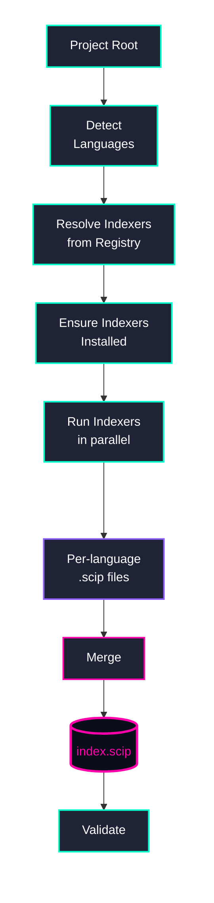
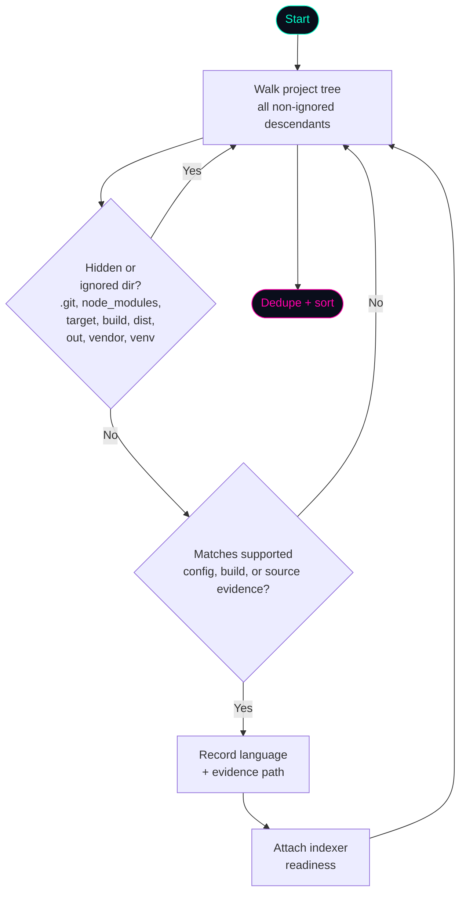
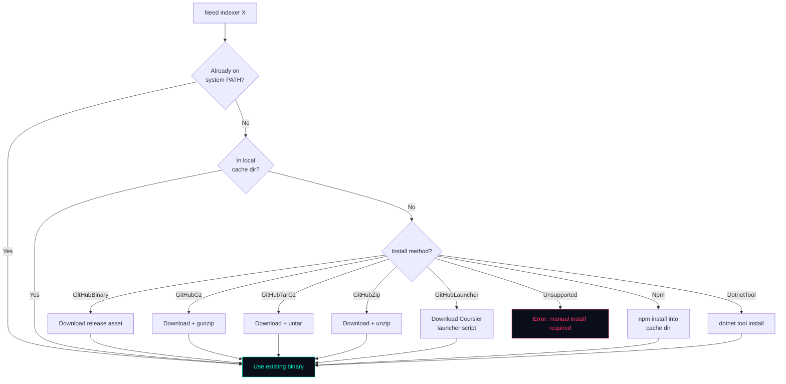
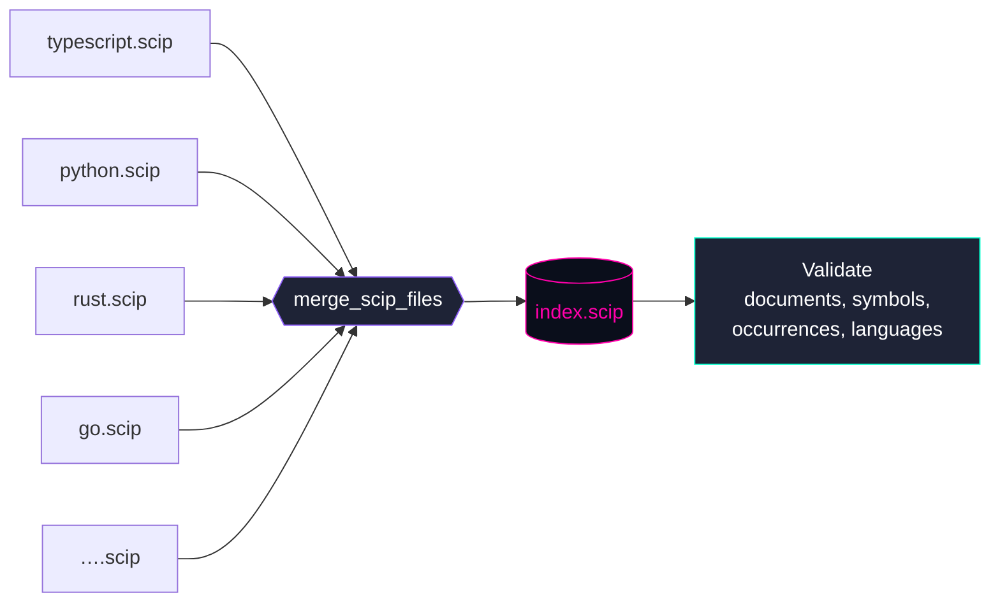

<p align="center">
  
</p>

<h1 align="center">SCIP-IO</h1>

<p align="center">
  <strong>One command. Every language. A single <code>index.scip</code>.</strong>
</p>

<p align="center">
  <em>SCIP Index Orchestrator — detect languages, download indexers, run them, merge the results.</em>
</p>

---

## What is SCIP-IO?

**SCIP-IO** is a polyglot [SCIP](https://sourcegraph.com/docs/code-search/code-navigation/scip) index orchestrator written in Rust. It takes the pain out of generating precise code-intelligence indexes for multi-language projects by doing the whole pipeline for you:

1. **Detects** every supported language in your project from project config files, build files, and source files.
2. **Installs** the latest compatible SCIP indexer binary for each language (downloading from GitHub releases, npm, `dotnet tool`, Coursier, or reusing what's already on your `PATH`).
3. **Runs** each indexer against your project with sensible defaults.
4. **Merges** every successful per-language `.scip` file into a single deterministic `index.scip`.
5. **Validates** the final index so you know it's wellformed.

If one or more language indexers fail after another language succeeds, SCIP-IO
publishes the successful output as a partial index instead of hiding it behind a
generic success message. The CLI text output, CLI JSON output, and GUI all mark
the result as partial and include the failed language count.

It ships as both a **CLI** (`scip-io`) and a **Tauri GUI** with a dark/cyberpunk-corporate aesthetic — use whichever fits your workflow.

### Why?

SCIP is the modern successor to LSIF for code intelligence. Every language has its own indexer, every indexer has its own install method, flags, and output conventions, and merging them requires understanding the SCIP protobuf schema. SCIP-IO collapses that entire workflow into:

```sh
scip-io index
```

---

## Supported Languages

SCIP-IO currently orchestrates **11 languages** across **9 different indexers**:

| Language     | Indexer           | Install Method        | Detection Evidence                    | Indexer Readiness |
|--------------|-------------------|-----------------------|---------------------------------------|-------------------|
| TypeScript   | `scip-typescript` | npm                   | `*.ts`, `*.tsx`, `tsconfig.json`, `tsconfig.*.json` | Ready |
| JavaScript   | `scip-typescript` | npm                   | `*.js`, `*.jsx`, `*.mjs`, `*.cjs`, `package.json` | Ready |
| Python       | `scip-python`     | npm                   | `*.py`, `*.pyw`, `pyproject.toml`, `setup.py`, `setup.cfg`, `requirements.txt`, `Pipfile` | Ready |
| Rust         | `rust-analyzer`   | GitHub release (gz/zip) | `*.rs`, `Cargo.toml`, `rust-project.json` | `Cargo.toml` or `rust-project.json` preferred |
| Go           | `scip-go`         | GitHub release (tar.gz) | `*.go`, `go.mod`                    | Ready |
| Java         | `scip-java`       | Coursier launcher     | `*.java`, `pom.xml`, `build.gradle`   | Ready |
| Scala        | `scip-java`       | Coursier launcher     | `*.scala`, `*.sbt`, `build.sbt`       | Ready |
| Kotlin       | via `scip-java`   | compiler plugin       | `*.kt`, `*.kts`, `build.gradle.kts`, `settings.gradle.kts` | Ready |
| C#           | `scip-dotnet`     | `dotnet tool`         | `*.cs`, `*.csproj`, `*.sln`, `*.vbproj` | Ready |
| Ruby         | `scip-ruby`       | GitHub release / WSL / Docker | `*.rb`, `Gemfile`             | Native Windows unsupported upstream; WSL/Docker backend on Windows |
| C / C++      | `scip-clang`      | GitHub release / WSL / Docker | `*.c`, `*.h`, `*.cc`, `*.hh`, `*.cpp`, `*.hpp`, `*.cxx`, `*.hxx`, `*.S`, `Makefile*`, `Kbuild*`, `Kconfig*`, `CMakeLists.txt`, `compile_commands.json` | `compile_commands.json` required; native Windows unsupported upstream |

SCIP-IO will also pick up any of these binaries already on your system `PATH` before downloading a fresh copy.

When you opt in with `--include-additional-configs` or the GUI's Extra configs
option, SCIP-IO also discovers secondary config files for indexers that accept
multiple config inputs. Today that includes root-level `tsconfig.json` and
`tsconfig.*.json` files for `scip-typescript` and `.sln`, `.csproj`, or `.vbproj` inputs for
`scip-dotnet`. Other languages continue to use their normal project-root or
workspace behavior until their indexers expose a safe multi-config contract.

---

## How it works

### High-level pipeline



### Language detection

Detection is **evidence-driven**. SCIP-IO reports supported languages from
project config files, build files, and source files, then separately reports
whether the default indexer has the setup it normally needs:



By default, indexing is repo-tree scoped: the selected root owns the full
non-ignored tree and SCIP-IO lets each upstream indexer decide which files it
can safely include. Use `--scope configs` when you want the legacy behavior that
promotes nested indexable manifests into their own project-root runs. That mode
covers TypeScript, JavaScript, Python, Rust, Go, Java, C#, Ruby, Kotlin, C/C++
with `compile_commands.json`, and Scala project configs. Parent roots exclude
those nested roots while scanning, so a parent repository does not accidentally
run a root-bound indexer against a child project's config.

C/C++ remains stricter than the other languages: `compile_commands.json` can
define an indexable nested root, but `CMakeLists.txt`, Makefiles, Kbuild, and
Kconfig files only prove that C/C++ exists. They do not provide enough
information for `scip-clang` unless a compile database is present.

### Indexer installation strategy

SCIP-IO supports several install methods because no two SCIP indexers ship the same way:



Both the CLI and GUI complete this "ensure installed" phase before launching
any indexer process, so a first run can resolve the latest compatible missing
indexer, download it, and still finish the requested index operation. Managed
installs record the installed version for later update checks. The GUI dashboard also exposes
Install/Uninstall actions for each registered indexer. Uninstall only removes
tools managed in SCIP-IO's local cache; binaries discovered on your system
`PATH` are reported as installed but must be removed outside SCIP-IO.
The CLI exposes the same lifecycle controls with `scip-io install`,
`scip-io uninstall`, and `scip-io update`; `scip-io update` checks installed
managed indexers, reports the results, and opens a terminal picker unless you
pass `--lang` or `--all` for non-interactive updates.
The Kotlin row is shown as covered by `scip-java`; installing or uninstalling
that row manages `scip-java`, which is the tool that provides Kotlin indexing.
The Settings update check inspects installed indexers, reports non-managed
tools separately, and offers per-indexer or bulk updates for managed installs
when a newer compatible version is available.
On Windows, SCIP-IO also repairs managed `scip-python` npm installs affected
by the upstream `path.sep` regex crash before running the indexer.

### Windows Linux Backends

Upstream `scip-ruby` and `scip-clang` do not publish compatible native Windows
release assets. SCIP-IO keeps those native installs marked unsupported on
Windows, but `scip-io index` can run the upstream Linux binaries through WSL or
Docker and still publish normal `ruby.scip` or `cpp.scip` files through the same
temp-output, compaction, validation, and atomic publish path.

The automatic backend preference is WSL first, then Docker. You can pin a
backend in `.scip-io.toml`:

```toml
[indexer.scip-ruby]
backend = "wsl"
wsl_distro = "Ubuntu-24.04"

[indexer.scip-clang]
backend = "docker"
docker_image = "my/scip-clang-runtime:latest"
```

When no Docker image is configured, SCIP-IO uses `ubuntu:24.04` so upstream
Linux indexer binaries have a recent enough glibc. Override `docker_image` when
your project needs additional build tools, headers, or package managers inside
the container.

When `wsl_distro` is set, status probes, path translation, binary permission
fixups, and indexer execution all run against that distribution instead of the
default WSL distro. WSL is reported as available only when SCIP-IO can run a
command inside the selected/default distro, so an installed WSL executable
without a registered runnable distro is not treated as ready. Invalid
`.scip-io.toml` now fails status/indexing commands with a config error rather
than silently falling back to defaults.

Ruby app projects do not always include a `.gemspec`. For those projects,
SCIP-IO supplies deterministic local `--gem-metadata <project>@0.0.0` when
running `scip-ruby`, so application repositories can produce `ruby.scip`
without pretending to be packaged gems.

C/C++ Linux backends require a Linux-compatible `compile_commands.json`.
SCIP-IO rejects Visual Studio or drive-letter compile commands such as
`C:\...`, `cl.exe`, or `clang-cl.exe` before invoking `scip-clang`; generate the
compile database inside WSL/Docker or use a matching Docker image/toolchain.

### Protected indexer execution

Every language indexer now runs through the same protected core runner used by
both the CLI and GUI. SCIP-IO writes each indexer result to a temporary file
first, normalizes document languages and repo-relative paths, compacts duplicate
documents, occurrences, and document symbols, validates the normalized SCIP, and
only then publishes `<language>.scip`. Failed or cancelled processes are killed
with the parent task, stdout/stderr are captured for diagnostics, and stale
successful outputs are left in place instead of being replaced by partial data.

When at least one indexer succeeds and another fails, the final output uses only
the successful `.scip` files and is reported as partial. CLI JSON includes
`partial`, `successful_outputs`, and `failed_languages`; the GUI completion
screen shows the same status plus per-language failure details.

Shard execution is capability-gated by upstream indexer contracts:

- Python uses `scip-python --target-only` shards for large trees.
- TypeScript/JavaScript and C# keep the fast single invocation by default, then
  retry memory failures with safe `tsconfig*`, `.sln`, `.csproj`, or `.vbproj`
  project-argument shards. Very large discovered config lists shard up front to
  avoid Windows command-line length limits.
- C/C++ can split large `compile_commands.json` files into command chunks,
  because `scip-clang` is already compile-command scoped.
- Go, Rust, Java, Scala, and Kotlin are planned around module/build roots only
  when the upstream indexer can safely honor that boundary; otherwise they keep
  the protected single-run behavior.
- Ruby currently uses protected single-run behavior because `scip-ruby` does
  not expose a safe shard boundary in SCIP-IO.

### Large Python projects

`scip-python` runs on Node.js and can exceed the default V8 heap on large
repositories. SCIP-IO now handles that automatically: when a Python project has
more than 750 `.py`, `.pyi`, or `.pyw` files, it runs `scip-python` over bounded
`--target-only` shards, prefixes shard-relative document paths back to the
repository root, and merges the shard outputs into the same `python.scip`
callers already expect. Initial shard targets may contain up to 5,000 Python
files to avoid excessive process startup overhead. Small shards run with
conservative bounded parallelism, while large shards run alone to keep peak
memory predictable. Loose files inside oversized directories are packed into
file batches so flat directories do not become thousands of one-file indexer
starts. If a large shard still hits a heap limit, SCIP-IO recursively splits it,
records that target as a local hint, and pre-splits the same target on later
runs instead of repeating the expensive failed attempt. Shard timing is logged
so large-project runs expose which targets dominate wall time. If `scip-python`
emits an empty document path for a single-file shard, SCIP-IO rewrites it to
that shard's repo-relative file path before merging so unrelated file facts
cannot collapse into one empty document.

A terminal shard failure still fails Python indexing instead of leaving a
misleading partial `python.scip`. Setting
`NODE_OPTIONS=--max-old-space-size=...` is no longer the recommended path for
large Python indexes; the bounded shard runner keeps peak memory lower for
machines with less RAM.

### Merge

Merging is deterministic: same inputs always produce a byte-identical
`index.scip`, regardless of which order indexers finished. Overlapping
documents (e.g. generated files touched by more than one indexer) are combined
rather than duplicated. SCIP-IO also compacts every indexer output and final
merged or copied output so duplicate `Document.relative_path` entries, duplicate
occurrences, and duplicate document symbols do not reach downstream consumers.
If a run is partial, the merge uses the successful language outputs and reports
the failed languages separately.



---

## Installation

### Quick install (CLI)

**Linux / macOS:**

```sh
curl -LsSf https://github.com/GlitterKill/scip-io/releases/latest/download/install.sh | sh
```

**Windows (PowerShell):**

```powershell
irm https://github.com/GlitterKill/scip-io/releases/latest/download/install.ps1 | iex
```

Both scripts download the right binary for your OS/architecture, extract it to a user-writable location (`~/.local/bin` or `%LOCALAPPDATA%\scip-io\bin`), and update your `PATH`.

### Manual download

Grab the right file for your platform from the [latest release](https://github.com/GlitterKill/scip-io/releases/latest):

| Platform                       | File                                                       |
|--------------------------------|------------------------------------------------------------|
| **CLI — Windows x64**          | `scip-io-vX.Y.Z-x86_64-pc-windows-msvc.zip`                |
| **CLI — macOS x64 (Intel)**    | `scip-io-vX.Y.Z-x86_64-apple-darwin.tar.gz`                |
| **CLI — macOS ARM (Silicon)**  | `scip-io-vX.Y.Z-aarch64-apple-darwin.tar.gz`               |
| **CLI — Linux x64**            | `scip-io-vX.Y.Z-x86_64-unknown-linux-gnu.tar.gz`           |
| **GUI — Windows installer**    | `SCIP-IO_X.Y.Z_x64-setup.exe` or `SCIP-IO_X.Y.Z_x64_en-US.msi` |
| **GUI — macOS disk image**     | `SCIP-IO_X.Y.Z_x64.dmg` / `SCIP-IO_X.Y.Z_aarch64.dmg`      |
| **GUI — Linux package**        | `scip-io_X.Y.Z_amd64.deb` or `scip-io_X.Y.Z_amd64.AppImage` |

Verify your download with `SHA256SUMS.txt` attached to the release.

> **Heads up — unsigned binaries:** Until SCIP-IO is code-signed, Windows SmartScreen will warn "unrecognized app" (click **More info → Run anyway**) and macOS Gatekeeper will block first launch (right-click the app → **Open**, then confirm).

### Build from source

Requires **Rust stable 1.80+** ([rustup.rs](https://rustup.rs)). For the GUI you also need the [Tauri 2 prerequisites](https://v2.tauri.app/start/prerequisites/) (WebView2 on Windows, `webkit2gtk` on Linux).

```sh
git clone https://github.com/GlitterKill/scip-io.git
cd scip-io

# CLI only
cargo build --release -p scip-io-cli
./target/release/scip-io --help

# GUI
cargo install tauri-cli --version "^2.0"
cargo tauri build
```

The CLI binary is `scip-io`; the GUI bundles as `SCIP-IO` via Tauri.

### Language toolchains

SCIP-IO downloads and manages indexer binaries, but some indexers need a language runtime installed on your system:

- **Node.js** — for `scip-typescript` and `scip-python` (both npm packages)
- **Go** — for `scip-go`
- **JDK/JVM** — for `scip-java` (Java, Scala, and Kotlin indexing)
- **.NET SDK** — for `scip-dotnet` (C# indexing)

SCIP-IO does not modify your persistent user or system PATH. For native
`scip-go` and `scip-java` runs, it probes project config, current environment,
PATH, and common install locations, then injects the discovered `bin` directory
into only the child indexer process. `JAVA_HOME` is injected only when SCIP-IO
has a validated Java home; PATH shims such as `java.exe` without a real JDK
home are used as executables without guessing `JAVA_HOME`. If auto-discovery
misses a valid install, set project-local homes in `.scip-io.toml`:

```toml
[toolchains.go]
home = "C:\\Program Files\\Go"

[toolchains.java]
home = "C:\\Program Files\\Eclipse Adoptium\\jdk-21"
```

Other indexers (`rust-analyzer` and the non-Windows builds of
`scip-ruby`/`scip-clang`) ship as standalone binaries. On Windows,
`scip-ruby` and `scip-clang` require WSL or Docker because upstream does not
publish native Windows assets. Run `scip-io status --verbose` to see native,
backend, and toolchain readiness.

## Getting Started

### Your first index

```sh
cd your/polyglot/project
scip-io detect          # see what SCIP-IO found
scip-io index           # download indexers, run them, merge → index.scip
scip-io validate index.scip
```

That's it. Point any SCIP-consuming tool at `index.scip`.

---

## CLI Commands

All commands accept `--help`. The examples below assume you're running them from inside the project you want to index.

### `scip-io detect`

Scan a project for supported languages without touching any indexers.

```sh
scip-io detect
scip-io detect --path ./services/api
scip-io detect --format json
scip-io detect --depth 5
```

**Example output:**

```
v Detected: rust, typescript, javascript
  * rust (found Cargo.toml; project_config; ready)
  * typescript (found gui/tsconfig.json; project_config; ready)
  * javascript (found gui/package.json; project_config; ready)
```

**Options:**

| Flag              | Description                                  |
|-------------------|----------------------------------------------|
| `-p, --path`      | Project root (defaults to current directory) |
| `-f, --format`    | `text` (default) or `json`                   |
| `-d, --depth`     | Optional max directory depth to scan         |

### `scip-io index`

The main event: detect, install, run, merge, and write a single `index.scip`.

```sh
# Index everything in the current directory
scip-io index

# Only index specific languages
scip-io index --lang rust,typescript

# Custom output path
scip-io index --output ./artifacts/project.scip

# Dry run — see what would happen, don't touch anything
scip-io index --dry-run

# Use legacy config-root scheduling for nested project configs
scip-io index --scope configs

# Discover only config-bearing roots under the project
scip-io index --all-roots

# Include supported secondary config files such as tsconfig.test.json
scip-io index --include-additional-configs

# Index specific sub-project roots
scip-io index --roots ./services/api,./services/web
scip-io index --path ./repo --roots ./services/api,./services/web

# Keep the per-language .scip files instead of merging
scip-io index --no-merge

# Control concurrency and timeouts
scip-io index --parallel 4 --timeout 600
```

**Options:**

| Flag              | Description                                                           |
|-------------------|-----------------------------------------------------------------------|
| `-p, --path`      | Project root                                                          |
| `-l, --lang`      | Comma-separated language filter (case-insensitive)                    |
| `-o, --output`    | Merged output path (default `index.scip`)                             |
| `--no-merge`      | Keep individual `.scip` files, skip the merge step                    |
| `--parallel`      | Max concurrent indexer processes                                      |
| `--timeout`       | Per-indexer timeout in seconds                                        |
| `-f, --format`    | `text` or `json` progress output                                      |
| `--dry-run`       | Print the plan without running anything                               |
| `--roots`         | Comma-separated sub-project roots to index; relative paths resolve from `--path` |
| `--scope`         | `repo-tree` (default) or `configs` root scheduling                     |
| `--all-roots`     | Compatibility alias for config-root discovery under `--path`, skipping ignored dirs |
| `--include-additional-configs` | Include supported secondary config files in each indexer run |

`scip-io index` defaults to repo-tree scope, so the selected `--path` is the
single ownership boundary for the index. Some upstream indexers still use their
own config/build model internally; SCIP-IO reports readiness warnings when that
means a repo-tree run may be partial. Use `--scope configs` for the previous
config-root scheduling method: nested project configs are indexed from their own
roots, SCIP document paths are prefixed before merging, and child-owned output
is pruned from parent runs. Use `--roots` when you want an explicit subset. Use
`--all-roots` when you specifically want the older discovered-config-root sweep.
`--roots`, `--scope configs`, and `--all-roots` merge generated `.scip` files
into the requested output unless `--no-merge` is set.

By default, SCIP-IO indexes the primary project config for a root. Use
`--include-additional-configs` when a repository keeps support scripts, test
targets, or secondary build surfaces in additional config files. For TypeScript,
SCIP-IO passes root-level `tsconfig.json` and `tsconfig.*.json` files to
`scip-typescript` in a single invocation, with `tsconfig.json` first. If that
combined run fails with a memory signature, SCIP-IO retries those configs as
sequential project-argument shards and merges the results. For .NET, SCIP-IO
passes all discovered `.sln`, `.csproj`, and `.vbproj` files to `scip-dotnet`
and uses the same safe retry behavior for memory failures.

TypeScript and JavaScript share `scip-typescript`, but SCIP-IO keeps them as
separate language runs when both are detected. The TypeScript run uses the
normal TypeScript project config behavior. The JavaScript run creates a
temporary root-local project config with `allowJs` and JavaScript-only globs
(`*.js`, `*.jsx`, `*.mjs`, `*.cjs`) so standalone JavaScript files are emitted
alongside TypeScript in the final merge instead of being hidden by an existing
`tsconfig.json`.

### `scip-io status`

Show which indexers are installed and where.

```sh
scip-io status
scip-io status --verbose
scip-io status --format json
scip-io status --check-updates
```

`--verbose` and `--format json` include toolchain preflight details for
indexers that need a runtime, including whether Go or Java was found, where it
was found, and which config or environment source supplied it.

**Example output:**

```
Indexer Status:
  scip-typescript   v0.4.0   ● installed   (npm cache)
  scip-python       v0.6.6   ● installed   (npm cache)
  rust-analyzer     2026-03-30  ● installed (PATH)
  scip-java         v0.12.3  ○ not installed
  scip-clang        v0.4.0   ○ not installed
```

### `scip-io install`

Install one indexer by language, indexer name, or binary name. Installs resolve
the latest compatible live version at runtime.

```sh
scip-io install python
scip-io install --lang rust
scip-io install scip-typescript
```

### `scip-io update`

Check installed indexers for newer compatible versions. With no arguments, the
command reports update status and opens a terminal menu with per-indexer choices
and an Update All option when more than one update is available.

```sh
scip-io update              # report updates, then choose from a terminal menu
scip-io update --lang rust  # non-interactive update for one language/indexer
scip-io update scip-dotnet  # non-interactive update by indexer name
scip-io update --all        # non-interactive update for every available update
```

Indexers installed outside SCIP-IO's managed cache are reported, but they are
not updated or removed by SCIP-IO.

### `scip-io uninstall`

Remove one SCIP-IO-managed indexer by language, indexer name, or binary name.

```sh
scip-io uninstall python
scip-io uninstall --lang kotlin  # removes managed scip-java
scip-io uninstall scip-python --dry-run
```

### `scip-io merge`

Manually merge a set of `.scip` files into one. Useful for CI where per-language files are built in separate stages.

```sh
scip-io merge ts.scip py.scip rust.scip --output all.scip
scip-io merge *.scip --output merged.scip --validate
```

**Options:**

| Flag              | Description                                 |
|-------------------|---------------------------------------------|
| `<inputs>`        | One or more `.scip` files (required)        |
| `-o, --output`    | Output path (default `index.scip`)          |
| `--validate`      | Validate the merged output after writing    |

### `scip-io validate`

Parse a `.scip` file, check structural invariants, warn on incomplete
document metadata such as missing languages, and print stats.

```sh
scip-io validate index.scip
scip-io validate index.scip --format json
```

**Example output:**

```
index.scip is valid
  documents:    1,247
  symbols:      38,091
  occurrences:  214,563
  languages:    rust, typescript, javascript
```

### `scip-io clean`

Remove cached indexer binaries. Prefer `scip-io uninstall <target>` for a single
indexer. `clean` only removes SCIP-IO-managed cache files; indexers discovered
on your system `PATH` are skipped.

```sh
scip-io clean                  # remove all installed managed indexers
scip-io clean --lang rust      # only rust-analyzer
scip-io clean --all            # wipe the whole cache dir
scip-io clean --dry-run        # show what would be removed
```

### `scip-io gui`

Launch the Tauri GUI (when the GUI crate is built).

```sh
scip-io gui
scip-io gui --path ./my-project
```

---

## Configuration

Drop a `.scip-io.toml` at the root of any project to override defaults:

```toml
# .scip-io.toml
output = "artifacts/index.scip"
scope = "repo-tree" # or "configs"
include_additional_configs = true
languages = ["typescript", "python"]

[settings]
parallel = 4
timeout = 600

[indexer.typescript]
binary = "/usr/local/bin/scip-typescript"   # use a custom binary

[indexer.rust]
args = ["scip", ".", "--exclude", "vendor"]

[indexer."scip-java"]
# Override the complete indexer command when a JVM build needs custom Gradle,
# SBT, or Maven targets. This applies to Java, Scala, and Kotlin because all
# three are handled by scip-java.
args = ["index", "--output", "index.scip", "--targetroot", "/tmp/scip-java-semanticdb", "--", "--no-parallel", "clean", "scipPrintDependencies", "scipCompileAll"]
```

Indexer override tables can be keyed by SCIP-IO language name
(`typescript`, `python`, `kotlin`) or by indexer name (`scip-typescript`,
`scip-java`). CLI and GUI indexing both use the same config loader and runner,
so backend, binary, version, and args overrides apply consistently in both
surfaces.

---

## Project Layout

```
scip-io/
├── crates/
│   ├── scip-io-core/      ← library: detection, registry, install, run, merge, validate
│   └── scip-io-cli/       ← scip-io binary (clap)
├── src-tauri/             ← Tauri v2 GUI backend
├── gui/                   ← Vite + TypeScript frontend
├── docs/assets/           ← README images, diagrams
└── Cargo.toml             ← workspace root
```

---

## Contributing

Issues and PRs welcome. Before sending a PR:

```sh
cargo fmt --all
cargo clippy --all-targets -- -D warnings
cargo test
```

The `CI` GitHub Actions workflow runs these same checks on Linux, macOS, and Windows for every PR.

## Releases

Releases are fully automated: pushing a `vX.Y.Z` git tag triggers `.github/workflows/release.yml`, which cross-compiles the CLI for Windows, macOS (Intel + Apple Silicon), and Linux, builds the Tauri GUI installers for all three OSes, and publishes everything to a GitHub Release with SHA-256 checksums and install scripts.

See [`RELEASING.md`](RELEASING.md) for the full release checklist and [`CHANGELOG.md`](CHANGELOG.md) for the version history.

---

## License

[MIT](LICENSE)
